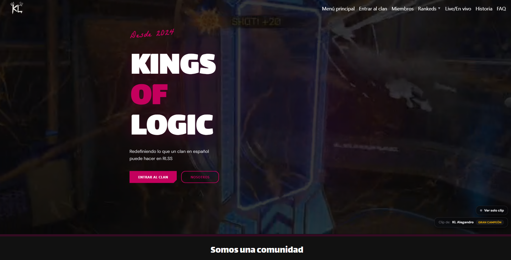
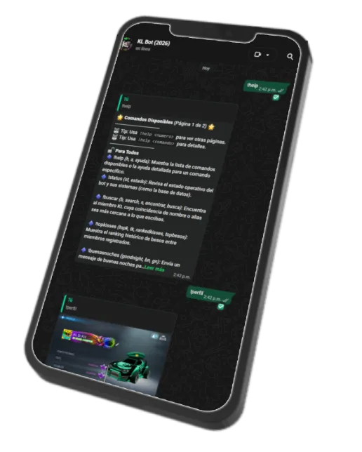

🌱 About me:  
Coding goes brrrrrr.

I'm currently focused as a JS/TS developer with strong ties to C#. (Fluency in Js/Ts + C#)
With experience:
- Frontend: Svelte, Astro  (html,js,css, tailwindcss, some with react)
- Backend: with ASP.NET Core or NestJs (same concepts)
- Winforms ☠️
- Lua (Relative to celeste modding + LOVE + KoReader Plugins)
- Dockers and CI Github actions pipelines
- Server admin stuff (Ubuntu server)
And some in:
- Go(lang) (Scripts and small programs with wails)
- Rust (Small programs with tauri)

📃🪴 My actual works

<h2 style="display: inline-block;">1. Whatsbotcord.js</h2> (Public)

Currently maintaining and developing my library <a href="https://github.com/KristanLaimon/WhatsBotCord.js" norel="noopener">Whatsbotcord.js</a> for my own use cases with whatsapp automation.

  

<h2 style="display: inline-block;">2. Kings Of Logic RLSS Administrator and Software Eng.</h2> (Private)

Admin in KL (A Rocket League Sideswipe clan) and their software-computer-whatever guy since 2024. I've created and currently maintaining/updating the following private projects:

- [KL Website](https://www.kingsoflogic.site): A website, what else to say  

- KL (Whatsapp) Bot: For handling tournament info, members and other stuff inside the clan chats. (Powered by Whatsbotcord.js)  

- KL Rest Api: Backend to feed KL Website with the content stored by Kl Bot. 

<h2 style="display: inline-block;">3. Celeste Modding and tooling</h2>(Public)  
  
As an experienced-addicted celeste player, from time to time I like to work on small projects like:  

- 
<a style="font-weight: bold;" href="https://github.com/KristanLaimon/TheCelesteTracker-Mod">TheCelesteTracker</a>: A compannion app to track all celeste stats through vanilla-mods-lobbies and all kinds of mods.

- 
<a style="font-weight: bold;" href="https://github.com/KristanLaimon/TheCelesteTracker-Mod">TheCelesteTracker-EverestMod</a>: Mod to store/track all stats while playing in real-time. Feeds TheCelesteTracker project

🦊 Contributions are always welcome.
