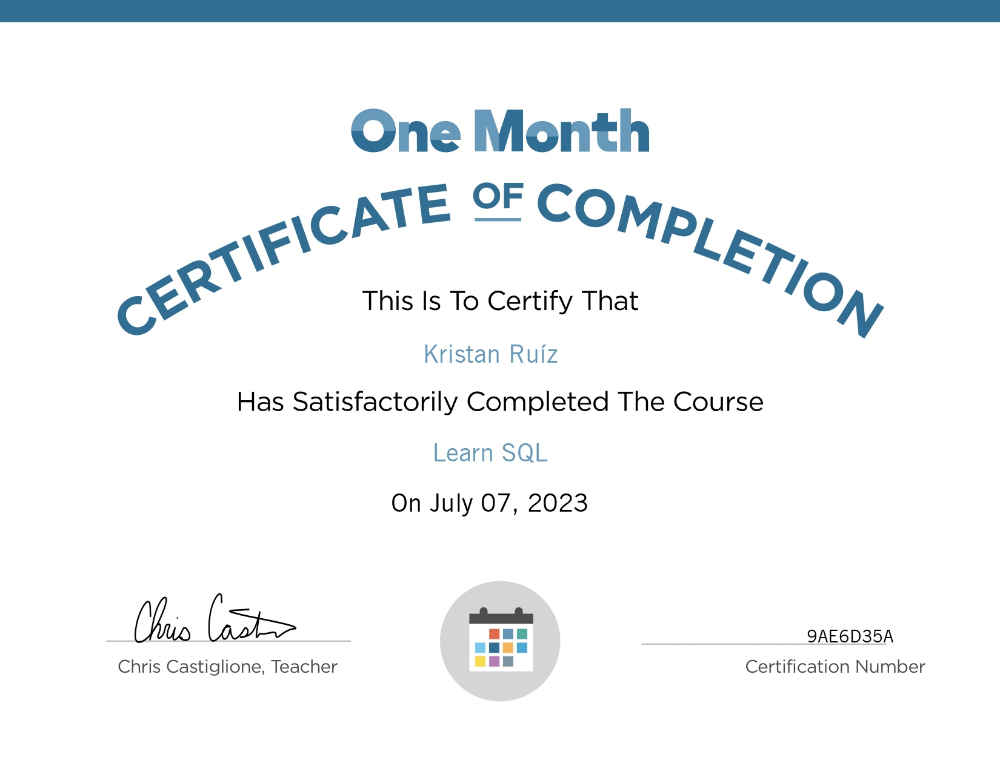

# More about me

  

I'm just a guy in love with computer science, it's branches and everything it has to offer. In this place i'm recolecting my active-passive skills in a list to see my progress and habilites. You can ignore it or wathever 🦊

Skills:

- [ ] Beginner-Intermediate C#
- [ ] SQL
- [ ] Use of MySQL databases
- [ ] Advanced Git
- [ ] HTML
- [ ] CSS (Some old knowledge)
- [ ] MarkDown

Certificates:

